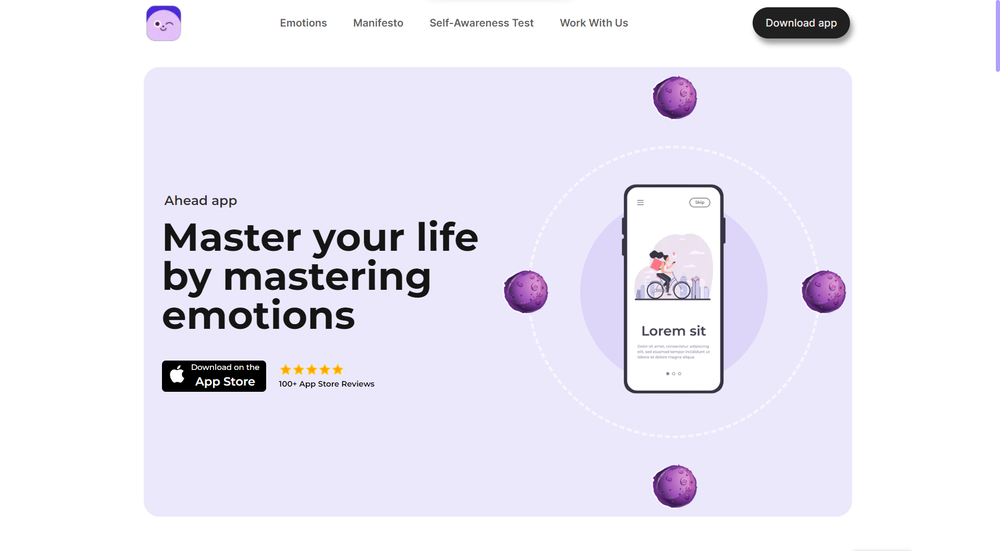
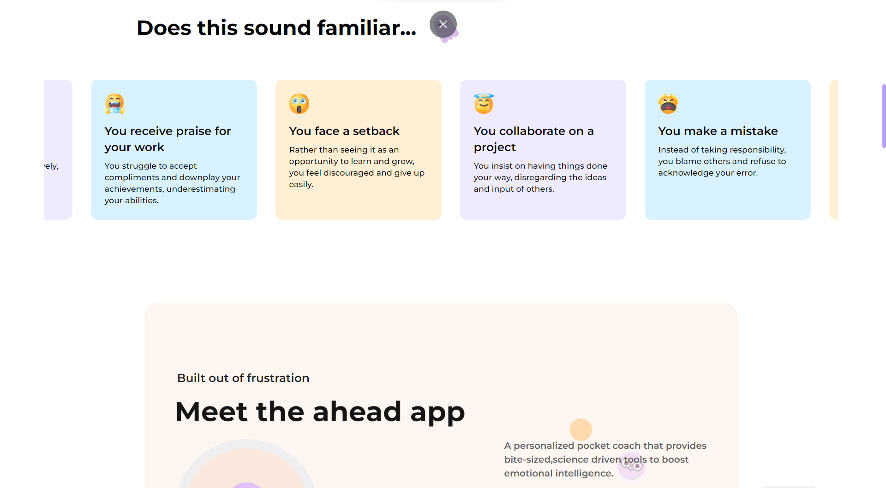

Here's a demo of dribble design implemented with framer motion animations 
<a href='https://dribbble.com/shots/19807069-Ahead-app-redesign-concept'>Design </a>
<video src="https://drive.google.com/drive/folders/15i0BzVhkzErBj0nsEsv3bgPIo8o_mdXl?usp=sharing" controls title="Density.Exchange-Assignment demo"></video>




## Getting Started

First, run the development server:

```bash
npm run dev
# or
yarn dev
# or
pnpm dev
```

Open [http://localhost:3000](http://localhost:3000) with your browser to see the result.

You can start editing the page by modifying `app/page.js`. The page auto-updates as you edit the file.

This project uses [`next/font`](https://nextjs.org/docs/basic-features/font-optimization) to automatically optimize and load Inter, a custom Google Font.
